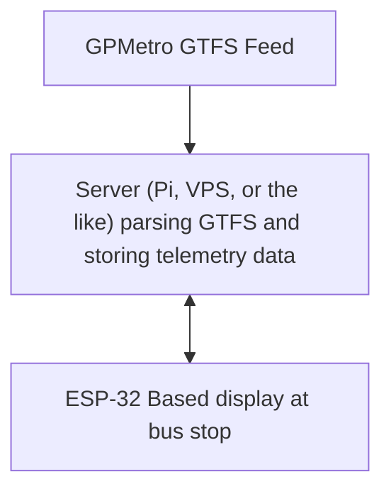

# Bus Departure Board

The goal of this project is to create a relatively low cost standalone live departure board for Portland Metro bus stops. This design uses an ESP32, e-ink display, and large LiFePo4 cell recharged via solar.

# Data downstream to ESP32
- Recent & Upcoming departures (Route #, deviation from schedule, est arrival time)
- Service Alerts
- optional text? Relevant city info?

# Data upstream from ESP32
- Battery voltage (SOC estimate?)
- Temperature (battery temp, external temp?)
- Timestamp of last update

# Arduino/ESP32 Libraries
**GxEPD2** - E-Ink display driver  
**WifiClientSecure** - For HTTPS  
**ESP32Time** - Why this one over time.h?

# Python Script Installation
`install requirements`  
`playwright install`  

# Open questions:
- Do we render an image for the ESP32 to display server side or does the server just parse the GTFS and the ESP32 can get it and render a display?
- How do we get telemetry back from the ESP32 to know if it's working? (Grafana dashboard 👀)

