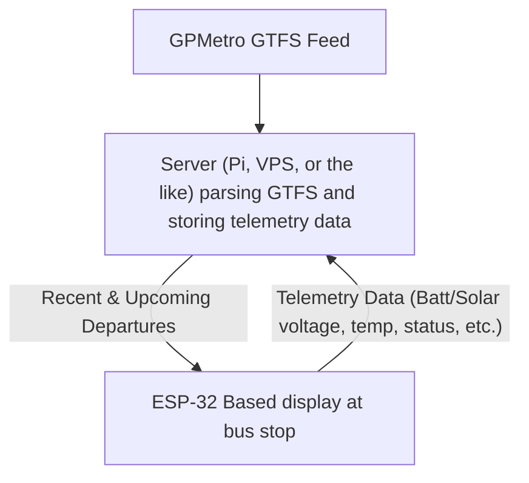

# Bus Departure Board

The goal of this project is to create a relatively low cost standalone live departure board for Portland Metro bus stops. This design uses an ESP32, e-ink display, and large LiFePo4 cell recharged via solar.

## Physical Layer Options
- Wifi via ESP32 hardware
    - Advantages: Built into the ESP32 hardware, easy to setup and well supported
    - Disadvantages: Wifi is not hugely reliable outdoors, and relying on random public networks as a part of infrastructure isn't great
- LoRa via external hardware
    - Advantages: LoRa has far better range and probably better reliability, and there's only one bridge to the internet instead of one on each ESP32. This solution might also be more scalable, though I'm not super familir with the scalability of LoRa used for this purpose
    - Disadvantages: Requires working around bandwith limitations (no photos sent to displays), and requires a gateway to bridge LoRa -> HTTPS. Also requires getting and using specialized LoRa hardware

### Arduino/ESP32 Libraries
**GxEPD2** - E-Ink display driver  
**WifiClientSecure** - For HTTPS  
**ESP32Time** - Why this one over time.h?

### Python Script Installation
`install requirements`  
`playwright install`  

## Open questions:
- Do we render an image for the ESP32 to display server side or does the server just parse the GTFS and the ESP32 can get it and render a display?
    - How much work does Todd's UCOP website do in the background to make that display?
    - How pretty/functional could the display be if it was rendered on the ESP32?
    - 
- How do we get telemetry back from the ESP32 to know if it's working? (Grafana dashboard 👀)

