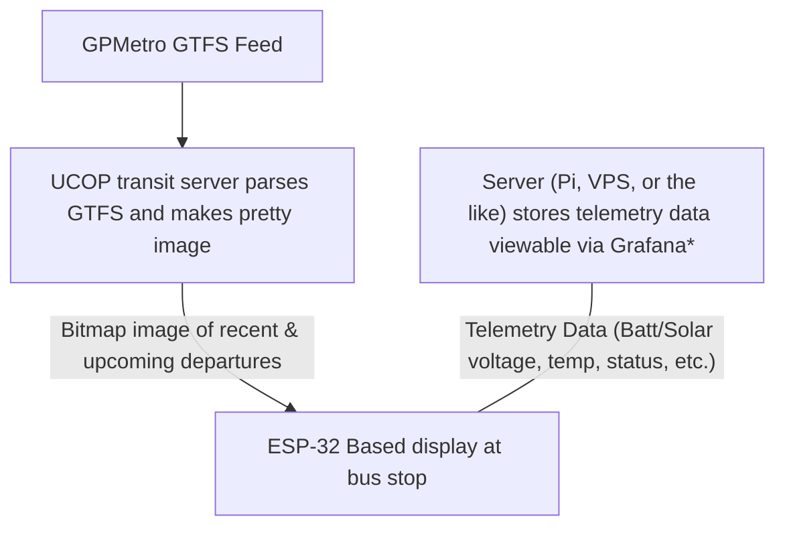

# GPMetro Bus Stop Departure Board

The goal of this project is to create a relatively low cost standalone live departure board for Portland Metro bus stops. This design uses an ESP32, e-ink display, and large LiFePo4 cell recharged via solar.

```mermaid
graph TD;

    A[GPMetro GTFS Feed] --> B["UCOP transit server parses GTFS and makes pretty image"];
    
    B -->|Bitmap image of recent & upcoming departures|C[ESP-32 Based display at bus stop];

    D["Server (Pi, VPS, or the like) stores telemetry data viewable via Grafana*"] ---|"Telemetry Data (Batt/Solar voltage, temp, status, etc.)"|C;
```
\*this was omitted from version 1

## Electrical Topology
[Read more here](docs/electricalTopology.md)

## Physical Layer Options
- Wifi via ESP32 hardware [ Selected for version 1 ]
    - Advantages: Built into the ESP32 hardware, easy to setup and well supported
    - Disadvantages: Wifi is not hugely reliable outdoors, and relying on random public networks as a part of infrastructure isn't great
- LoRa via external hardware
    - Advantages: LoRa has far better range and probably better reliability, and there's only one bridge to the internet instead of one on each ESP32. This solution might also be more scalable, though I'm not super familir with the scalability of LoRa used for this purpose
    - Disadvantages: Requires working around bandwith limitations (no photos sent to displays), and requires a gateway to bridge LoRa -> HTTPS. Also requires getting and using specialized LoRa hardware
- Cellular
    - Advantages: Reliability, range, throughput (can still do bitmaps). This is what the commercially available products use.
    - Disadvantages: Cost (hardware, subscription), power consumption.
- A secret fourth thing??

### Arduino/ESP32 Libraries
**GxEPD2** - E-Ink display driver  
**WifiClientSecure** - For HTTPS  
**ESP32Time** - Why this one over time.h?

### Python Script Installation
`install requirements`  
`playwright install`  

### Improvements for rev 2:
- Use backplane bracket inside the waterproof case so servicing is easier
    - Attach display to backplane instead of the front of the case
    - Attach all other bits to the backplane so it can be swapped out easily if needed
- Cellular connectivity
- Telemetry (grafana dashboard or the like)