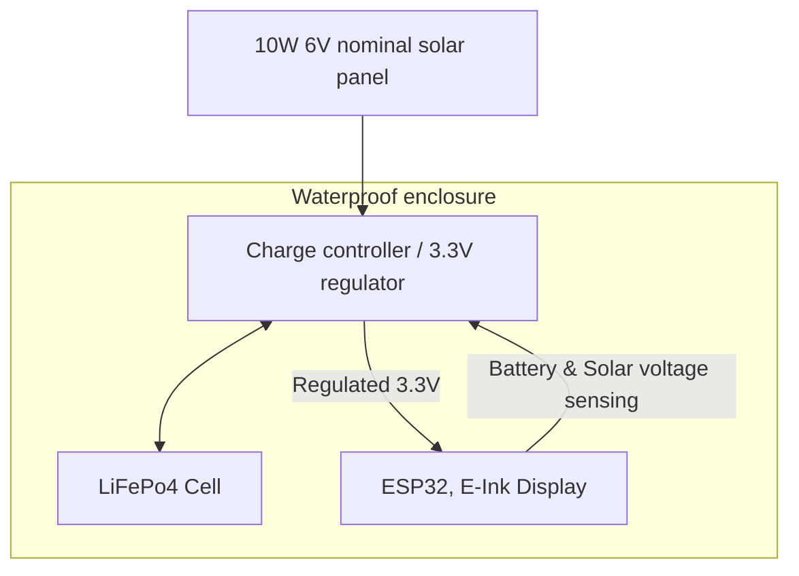

# Electrical Topology

The electrical design is based around a 10 watt solar panel, 1 large LiFePo4 cell, and a combo charge controller/3.3V regulation board.

### Solar Power

10W was chosen as a conservative target for powering through long stretches of overcast short winter days

### Battery Storage
LiFePo4 was chosen due to its relatively high power density, safety, and availability. Here are some other options I explored and their pros/cons as relevant to this application:
- Sealed Lead Acid
    - Pros: Robust proven extremely stable chemistry, practically no safety risks, inexpensive, low temp charging and happy to be float charged off of solar
    - Cons: Low power/capacity density, higher voltage
- LiPo
    - Pros: Power density is great, lots of available form factors, cell configurations, and management circuits
    - Cons: Safety concerns around operating in an enclosure that will be exposed to sun on hot days. Performance suffers in cold weather (can't be charged or discharged too far below freezing)
- LTO
    - Pros: Incredible stability & robustness while maintaining decent power density. Can be charged/discharged below freezing.
    - Cons: Pricey! Low cell voltage makes it hard to design around, and management circuits are not widely available.

LiFePo4 strikes a good balance between a lot of the factors listed above. It has decent stability, can be discharged below freezing, is widely available, and there are management chips that are designed around it (see below). It isn't technically supposed to be charged below freezing, but it will be operating at quite low current and I'm not worried about a little bit of lithium plating/degradation.

### Combo LiFePo4 charge controller & 3.3V regulator
https://github.com/wagiminator/Power-Boards/tree/master/LiFePO4_Power_Board_LS_3V3 